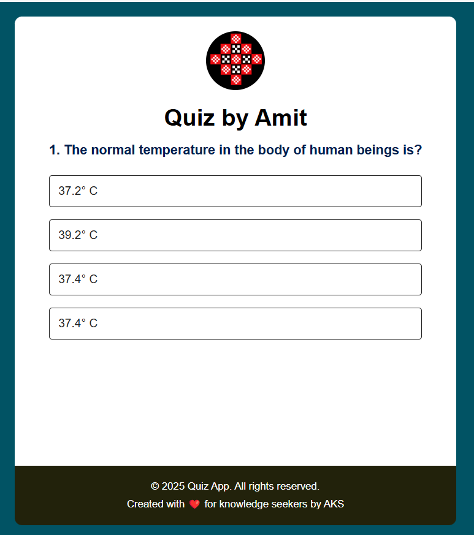

# Quiz-App
This is Quiz App using HTML,CSS and JavaScript.
# Quiz App by Amit



A responsive, interactive quiz application built with HTML, CSS, and JavaScript.

## Features

- Multiple-choice questions with visual feedback
- Navigation between questions (Next/Back buttons)
- Score calculation at the end of the quiz
- Responsive design that works on mobile and desktop
- Persistent answer tracking (can go back to review answers)
- Visual indicators for correct/incorrect answers
- Clean, modern UI with custom styling

## Technologies Used

- HTML5
- CSS3 (with Flexbox and media queries)
- JavaScript (ES6)

## Demo

[Live Demo](#) *(Add your live demo link here when deployed)*

## Installation

No installation required! Simply:

1. Clone this repository or download the ZIP file
2. Open `index.html` in your web browser

## Usage

1. Read each question carefully
2. Select your answer by clicking on one of the buttons
3. Use the "Next" button to proceed or "Back" to review previous questions
4. View your final score at the end of the quiz
5. Click "Play Again" to restart the quiz

## Customization

To customize the quiz:

1. Edit the `questions` array in `script.js` to add/remove questions:
```javascript
const questions = [
    {
        question: "Your question here",
        answers: [
            {text: "Answer 1", correct: true/false},
            {text: "Answer 2", correct: true/false},
            // etc...
        ]
    },
    // Add more questions...
];

 2. Modify the styling in style.css to change colors, fonts, etc.

 3. Replace logo.jpeg in the images folder with your own logo (recommended size: 80x80px)

## Screenshots
(images/Screenshot.png)

## Contributing
Contributions are welcome! Please fork the repository and create a pull request with your improvements.

## License
This project is licensed under the MIT License - see the LICENSE file for details.

## Acknowledgments
Created with ❤️ by AKS

Inspired by knowledge seekers everywhere
